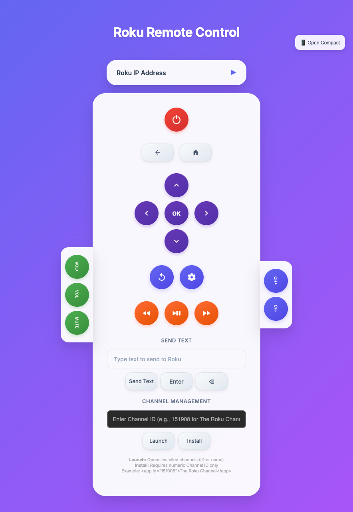

# Roku Remote Control



A modern, web-based remote control for Roku devices withcomprehensive functionality.

## Features

### 🎛️ Complete Remote Functionality
- **Navigation controls** - Directional pad with up, down, left, right, and select
- **Media controls** - Play, pause, rewind, fast forward, instant replay
- **Volume controls** - Volume up/down with dedicated side panel
- **Channel controls** - Channel up/down with dedicated side panel
- **Power and system** - Power, home, back, and options buttons
- **Text input** - Send text strings to Roku for search and typing
- **Channel management** - Launch and install channels by ID

### ⚙️ Advanced Features
- **IP address configuration** with collapsible interface
- **Local storage** - Remembers your Roku IP address
- **Status feedback** - Real-time success/error messages
- **Keyboard shortcuts** - Enter and Backspace support for text input
- **Compact window** - Opens optimised popup window for daily use

## Getting Started

### Prerequisites
- A Roku device connected to the same network as your computer
- Modern web browser (Chrome, Firefox, Safari, Edge)
- Roku device with External Control Protocol (ECP) enabled

### Installation

1. **Clone the repository:**
   ```bash
   git clone https://github.com/RobsonHarrison/RokuRemote.git
   cd RokuRemote
   ```

2. **Open the remote:**
   - Open `RokuRemote.html` in your web browser
   - Or serve it from a local web server

3. **Configure your Roku IP:**
   - Find your Roku's IP address in Settings → Network → About
   - Enter the IP address in the configuration section
   - Click "Save IP" to store it locally

### Finding Your Roku IP Address

1. On your Roku device, go to **Settings**
2. Select **Network**
3. Choose **About**
4. Note the IP address displayed

## Remote Button Mappings

### Navigation Controls
| Button | ECP Command | Description |
|--------|-------------|-------------|
| ↑ | `keypress/up` | Navigate up |
| ↓ | `keypress/down` | Navigate down |
| ← | `keypress/left` | Navigate left |
| → | `keypress/right` | Navigate right |
| OK (Centre) | `keypress/select` | Select/confirm |

### System Controls
| Button | ECP Command | Description |
|--------|-------------|-------------|
| Power | `keypress/power` | Power on/off |
| Home | `keypress/home` | Return to home screen |
| Back | `keypress/back` | Go back/cancel |
| Options | `keypress/info` | Show options/info |

### Media Controls
| Button | ECP Command | Description |
|--------|-------------|-------------|
| Play/Pause | `keypress/play` | Toggle play/pause |
| Rewind | `keypress/rev` | Rewind/skip back |
| Fast Forward | `keypress/fwd` | Fast forward/skip ahead |
| Instant Replay | `keypress/instantreplay` | Jump back 10 seconds |

### Volume Controls
| Button | ECP Command | Description |
|--------|-------------|-------------|
| Volume Up | `keypress/volumeup` | Increase volume |
| Volume Down | `keypress/volumedown` | Decrease volume |
| Mute | `keypress/volumemute` | Toggle mute |

### Channel Controls
| Button | ECP Command | Description |
|--------|-------------|-------------|
| Channel Up | `keypress/channelup` | Next channel |
| Channel Down | `keypress/channeldown` | Previous channel |

### Text Input
| Function | ECP Command | Description |
|----------|-------------|-------------|
| Send Text | `keypress/Lit_{character}` | Send individual characters |
| Enter | `keypress/enter` | Confirm text input |
| Backspace | `keypress/backspace` | Delete character |

### Channel Management
| Function | ECP Command | Description |
|----------|-------------|-------------|
| Launch Channel | `launch/{channel_id}` | Launch channel by ID |
| Install Channel | `install/{channel_id}` | Install channel by ID |

## Usage Examples

### Basic Navigation
1. Enter your Roku IP address and save it
2. Use the directional pad to navigate menus
3. Press OK (centre button) to select items
4. Use Home to return to the main screen

### Text Input
1. Click in the "Send Text" field
2. Type your search term or text
3. Click "Send Text" to transmit to Roku
4. Use Enter or Backspace as needed

### Channel Management
1. Find a channel ID (e.g., 151908 for The Roku Channel)
2. Enter the ID in the Channel Management field
3. Click "Launch" to open the channel
4. Click "Install" to add the channel to your Roku

### Compact Mode
1. Click "📱 Open Compact" in the top-right corner
2. A new optimised window opens
3. Perfect for keeping alongside other applications
4. All functionality available in compact form

## Technical Details

### Roku External Control Protocol (ECP)
This remote uses Roku's ECP API, which communicates via HTTP requests:
- **Base URL:** `http://{roku_ip}:8060/`
- **Keypress:** `keypress/{command}`
- **Launch:** `launch/{channel_id}`
- **Install:** `install/{channel_id}`

### Network Requirements
- Roku and computer must be on the same network
- Port 8060 must be accessible on the Roku device
- No additional firewall configuration typically required

## Contributing

Contributions are welcome! Please feel free to submit a Pull Request. For major changes, please open an issue first to discuss what you would like to change.
